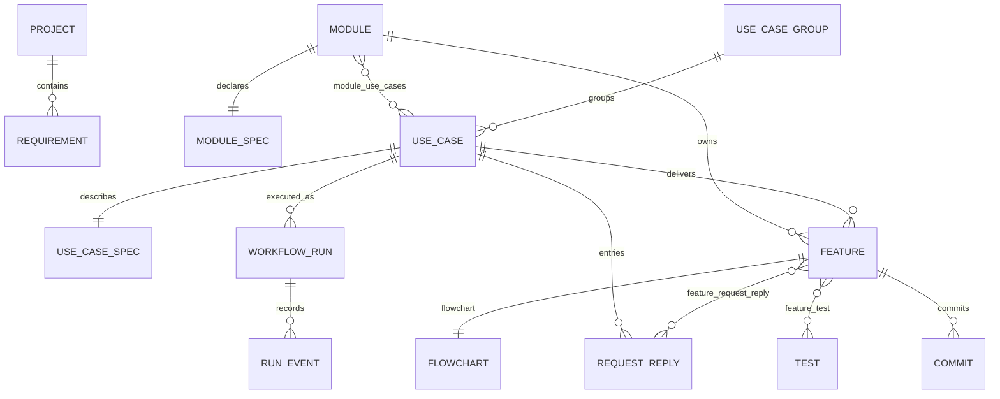

# 方案模型与执行图

## 原始讨论

你的直觉是对的，但我觉得关键不是“给 requirements 多几列”，也不是单纯加一张 feature 步骤表。你现在撞到的是一整层**方案模型**缺失，而且这层不是一张表能解决的。

**AI 写代码时发现的新问题，通常属于四类东西**

- 业务事实：谁会做什么、什么条件下做什么。
- 行为规则：前置状态、状态变化、失败分支、并发与幂等。
- 方案决定：数据结构、接口边界、职责划分、取舍理由。
- 实现任务：迁移、服务、页面、测试、回滚。

AI 现在从“很粗的需求”直接跳到“实现任务”。写代码时才发现的东西，本来大多应该在前面被问出来。因为前面没有承载它们的地方，只能一边写一边改，最后形成补不完的 bug。

所以你说的那一层，应该叫**方案层**，更具体一点是：

```text
需求意图
→ 用例（含异常走法）
→ 业务规则与不变量
→ 方案决策
→ 功能设计
→ 实现节点
→ 代码与测试证据
```

不是一个名字，而是一条链。把它们塞进一张表，后面仍然分不清“这是需求漏了、规则没定、方案选错，还是实现没写”。

**ModuleSpec 不应该变成一块无限扩展的 textarea**

Module 只保留一份当前 ModuleSpec，用文本章节保存本模块自己的目标、范围、非目标、
来源、规则、数据语义、已接受决策和验收边界。跨模块的流程写进 UseCaseSpec。下面应该是：

- `use_cases`：谁为了什么目标，触发什么行为，成功和失败是什么。
- `rules` / `invariants`：无论走哪条路径都必须成立的事实。
- 决策章节：还有哪些问题没定，为什么这样定，影响哪些用例和功能。
- 入口（`request_replies`）：一次 request→response。同一目标的不同走法写进 Use Case Spec 的 `## 异常与补偿`，由测试盖住（没有 scenarios 表）。
- 流程图（`flowcharts`，功能 1:1）：这个功能的代码怎么流动——`chart` JSON（节点带 `file`/`function`，边 `next`/`failure`）+ `pseudocode` 编号伪代码。功能（Feature）是工作项，通过 `feature_request_reply` 记它改了哪些入口。

这里最重要的是决策章节。AI 每发现一个新问题，不能直接开始修，而要先分类：

```text
缺少事实 → question
需要业务拍板 → decision
缺少行为 → Use Case Spec 的异常与补偿 + 测试
会破坏业务事实 → invariant
只是实现拆分 → 流程图节点
```

分类完成后，沿边标记哪些用例、测试、代码和数据流受影响。这就是你前面说的“回边”，而且回边有原因、有范围、可恢复。

**树是对的，但只适合一部分关系**

我更倾向于混合结构：

- 分解关系用树：需求 → 能力 → 用例 → 实现节点。
- 依赖关系用有向图：A 必须在 B 前，决定 D 会让用例 U 的某条走法失效。
- 业务行为用状态机：订单从什么状态，经过什么事件，允许进入什么状态。
- 执行过程用事件账：谁在哪个节点、执行了几次、聊了什么、产生了什么结果。

纯树的问题不是不能穷举，而是每个分支都要重新复制共同规则。几个状态、权限、输入、外部失败和并发一组合，树会爆炸。真正有限的是**状态空间和等价类**，不是所有表面组合。

“用户可以退款”可以展开成：

```text
用例：用户申请退款
不变量：退款金额 ≤ 已支付金额；成功退款不能重复入账
正常：支付成功、在期限内、全额退款
替代：部分退款
错误：未支付、超金额、超期限
并发：两个退款请求同时到达
外部失败：支付网关超时
恢复：网关成功但数据库落库失败，如何补偿
```

然后才产生功能与实现节点。这样 AI 写代码时发现新问题，是因为边界确实需要扩张；不是因为它拿着一张残缺地图开始施工。

**需求怎么补完整**

需要一套固定的追问顺序，而不是让 AI 自由发挥：

1. 保留原话，明确谁是需求提出者。
2. 找出业务目标、收益和明确不做的范围。
3. 建立业务术语和领域对象。
4. 找事实、规则和永远不能违反的不变量。
5. 展开用例，在 Use Case Spec 里写正常、替代、异常和恢复走法。
6. 把所有未知项变成问题或显式假设。
7. 决定方案，并记录为什么。
8. 从用例走法反推功能和测试。
9. 最后才排实现节点。

边界案例可以用统一维度检查：状态、权限、输入边界、空数据、老数据、外部系统、超时、重试、并发、幂等、补偿、人工介入、滥用。不是追求列完宇宙中的所有情况，而是把系统闭合在明确边界内，再按等价类穷举。

**我的结论**

你不缺一张“feature 步骤表”，缺的是它前面的方案层。最重要的是两件事：

1. 所有不确定性必须落成 `question / decision / Use Case Spec 走法 / invariant`，不能藏进代码和聊天。
2. 实现节点必须由已确认的用例和决策推导，不能直接由一句 Feature 推导。

project-manager 现在保存的是业务事实和最终证据，适合接在这套系统后面。真正的核心会是“方案模型 + 决策账 + 实现图 + 事件账”。树用来拆，图用来连，状态机用来描述行为，事件账用来记住你怎么走到今天。

## 表关系设计

### 第一原则：计划和运行分开

流程图（`flowcharts`）是计划，描述代码要怎么走。运行状态放在 `workflow_runs` 和 `run_events` 中；计划可以改，历史运行不能因此被改写。

### 领域层

`module_specs` 写模块自己的已确认事实，`use_case_specs` 写跨模块流程。

- `modules 1 ── 1 module_specs`
- `modules * ── * use_cases`，通过 `module_use_cases`
- `use_case_groups 1 ── * use_cases`
- `use_cases 1 ── 1 use_case_specs`
- `modules 1 ── * features`，通过 `features.module_id`（必须是该 UseCase 参与的模块）

规则、决策等内容是 ModuleSpec / UseCaseSpec 的文本章节。
`requirements` 只保留原始来源和旧数据，不再是 UseCase 的父级。

### 行为层

- `use_cases 1 ── * features`，通过 `features.use_case_id`

同一目标的正常、替代、错误、并发、恢复走法写在 `use_case_specs.content` 的 `## 异常与补偿`，
每条走法由挂在功能上的测试（`feature_test`）盖住。

规则和决策都是 Spec 的文本章节，不再独立建模；改变决策时直接保留清晰的历史文字，
必要时在章节里写明 superseded/stale。

### 功能与流程图

- `features 1 ── 1 flowcharts`：`chart` JSON `{"nodes":[{id,label,shape,file?,function?}],"edges":[{from,to,label?,kind?}]}`，保存时 Model 校验节点 id 唯一、边两端存在、shape/kind 合法；`pseudocode` 是编号伪代码，失败分支缩进并以「若 条件：」开头。
- `features * ── * request_replies`，通过 `feature_request_reply`

调用树（`implementation_nodes` + 边）已迁成每个功能一张流程图并删表；共享入口的节点复制给每个挂它的功能。

### 测试与提交证据

- `features * ── * tests`，通过 `feature_test`
- `features 1 ── * commits`，通过 `commits.feature_id`

### 运行层

- `workflow_runs 1 ── * run_events`

`workflow_runs` 核心字段：

```text
project_id
use_case_id（运行挂在 UseCase 上；有 feature 时 feature 必须属于该 UseCase）
requirement_id（legacy）
graph_version
status: pending | talking | running | waiting | paused | done | failed
```

`run_events` 是追加式事件账：

```text
workflow_run_id
event_type
payload
created_at
```

### 完整关系图



### 不能破坏的系统不变量

- 一个项目下的所有关联对象必须属于同一个项目。
- `tests` 和 `commits` 只能挂到同一项目的功能；功能和入口必须同项目。
- Use Case Spec 里的走法没有测试盖住时，所属功能不能进入最终完成。
- 运行中的契约使用快照，之后修改计划不能改写历史运行。
- 决策变化保留在 Spec 的历史文字中，不删除旧证据。

### 最小落地顺序

第一版不要一次建完整运行层。按下面顺序落地：

1. `use_cases`、`use_case_specs`
2. 决策与业务规则写回 ModuleSpec / UseCaseSpec
3. 功能的 `flowcharts`
4. `workflow_runs`
5. `run_events`
6. 最后回填 `tests`、`commits` 的证据关系

这样每一层都能单独使用。前面三层即使没有运行时，也能阻止 AI 从一句粗需求直接跳到代码。
